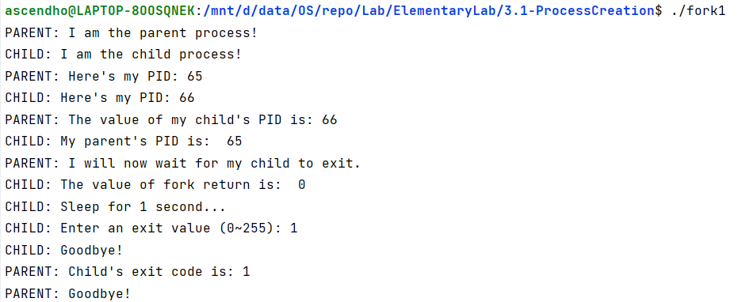
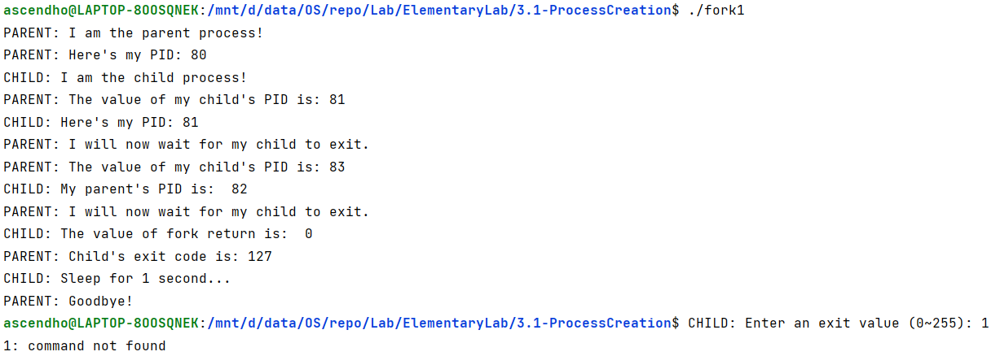

## 实验思考

1. 总结调用fork()函数后的三种返回情况

fork()系统调用有3种返回情况：返回值>0，表示当前进程是父进程，这个返回值为子进程的进程ID值；等于0，表示当前进程是子进程；小于0，表示进程创建失败，需要报错。

2. 总结fork()和wait()配合使用的情况，并尝试在父进程中取消wait()函数，观察进程的运行情况

当父进程中同时使用fork()和wait()/waitpid()函数时，父进程会处于阻塞状态等待子进程的运行结束。如果父进程中没有调用wait()/waitpid()函数，则父进程和其创建的子进程属于并发进程，也就是父进程和子进程**几乎是独立运行**的，而且，需要注意的是，在父进程先运行完成的情况下，子进程会成为**孤儿进程**，不再继续运行

			<!--块级封装-->
    
	<!--将图片和文字居中-->
    
     		<!--换行-->
    父进程中使用wait函数	<!--标题-->
    

------

			<!--块级封装-->
    
	<!--将图片和文字居中-->
    
     		<!--换行-->
    父进程中未使用wait函数且父进程先运行结束	<!--标题-->
    

