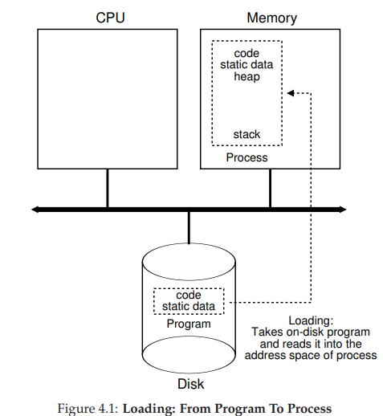

**注**：笔记内容均截取自开源书籍<a href="https://pages.cs.wisc.edu/~remzi/OSTEP/">Operating Systems: Three Easy Pieces</a>，中文译本为人民邮电出版社旗下的异步社区出版的<a href="https://www.epubit.com/bookDetails?id=N16113">《操作系统导论》</a>。

------

## 关键概念

1. 加载：从程序到进程

