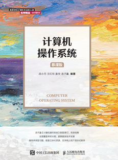
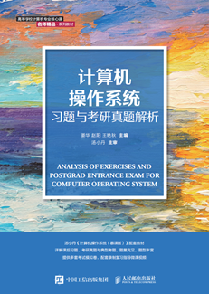
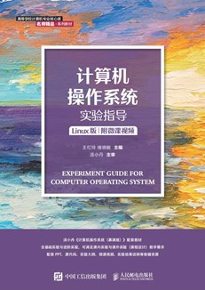
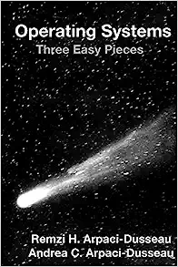

## 文件说明 Clarification

- **Lab**: 包含基础实验和进阶实验的源码、思考题解答和幻灯片

- **MindMap**: 主教材各章节思维导图

- **Notes**: 主要截取一些源自开源书籍<a href="https://pages.cs.wisc.edu/~remzi/OSTEP/">Operating Systems: Three Easy Pieces</a>的插图

------

## 目录 Contents

|                           基础实验                           |             进阶实验             |
| :----------------------------------------------------------: | :------------------------------: |
| <a href="Lab\ElementaryLab\2.1-UsageOfLinuxcommands">Linux常用命令使用</a> |          编译Linux内核           |
| <a href="Lab\ElementaryLab\2.2-ProgramCinLinux">Linux下C程序编写</a> |         添加一个系统调用         |
| <a href="Lab\ElementaryLab\3.1-ProcessCreation">进程的创建</a> |         统计系统缺页次数         |
|                      进程调度算法的模拟                      |     统计一段时间内的缺页次数     |
|                      两个进程间相互通信                      |      编写一个简单的内核模块      |
|                         进程同步实验                         | 利用内核模块创建一个设备文件节点 |
|                    动态分区分配方式的模拟                    |       设计一个简单文件系统       |
|                      页面置换算法的模拟                      |       编写字符设备驱动程序       |
|                         文件备份实验                         |        编写块设备驱动程序        |

**实验环境**：

Ubuntu 20.04.4 LTS

------

## 参考书目 Bibliography

|              教材              |                        作者                         |                             图示                             |                           资源链接                           |
| :----------------------------: | :-------------------------------------------------: | :----------------------------------------------------------: | :----------------------------------------------------------: |
|    计算机操作系统（慕课版）    |                   汤子瀛、汤小丹                    |     | <a href="https://www.ryjiaoyu.com/book/details/42942">人邮教育</a> |
| 计算机操作系统习题与考研真题解 |                 姜华、赵阳、王艳秋                  |  | <a href="https://www.ryjiaoyu.com/book/details/43176">人邮教育</a> |
|     计算机操作系统实验指导     |                       王红玲                        |      | <a href="https://www.ryjiaoyu.com/book/details/44907">人邮教育</a> |
|          操作系统导论          | Remzi H. Arpaci-Dusseau Andrea C. Arpaci-Dusseau |  | <a href="https://pages.cs.wisc.edu/~remzi/OSTEP/">OSTEP</a>  |

**注**：《操作系统导论》的作者将其英文原版教材分章节**免费开源**了，可点击表格中的资源链接获取

------

## 声明 Disclaimer

- 该项目**仅用于学习交流**，凡是可能涉及到的版权问题，归**教材原作者所有**
- 本人所贡献的部分，遵从`MIT`协议

最后，如果你认为这个项目帮助到了你，不妨给个star✨!

------

